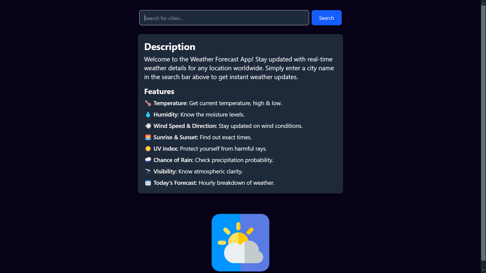
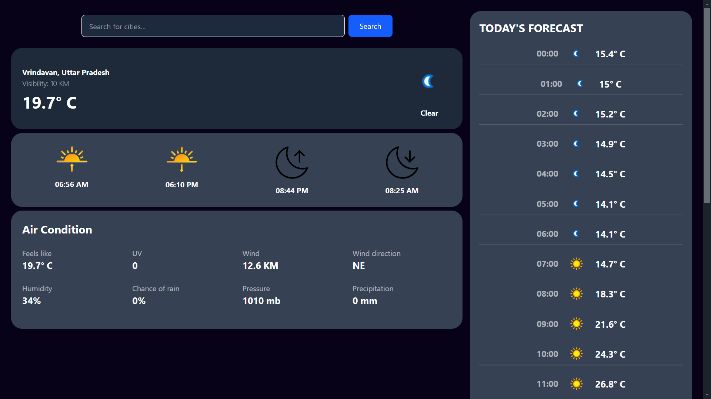

# 🌤 Weather Forecast App  

A **responsive** weather forecasting web application built with **ReactJS** and **RapidAPI**, providing real-time weather updates for any city worldwide!  

## 🚀 Features  
- 🔍 **Search any city** to get instant weather details  
- 🌡️ **Current Temperature, Humidity, and Wind Speed**  
- ☀️ **Sunrise & Sunset Timings**  
- 🌦️ **Hourly & Daily Forecasts** with precipitation chances  
- 🌀 **UV Index, Air Conditions, and Visibility**  
- 📱 **Fully Responsive** – Works on all devices  

## 🛠 Tech Stack  
- **Frontend:** ReactJS (Axios, React Router, Context API)  
- **Styling:** Tailwind CSS, DaisyUI  
- **API:** RapidAPI (for real-time weather data)  
- **Hosting:** Vercel  

## 📷 Screenshots  
### Home Page  
  

### Weather Details  
  

## 🚀 Live Demo  
Check out the live app here: **[Weather Forecast App](https://weather-forecast-zeta-blush.vercel.app/)**  
